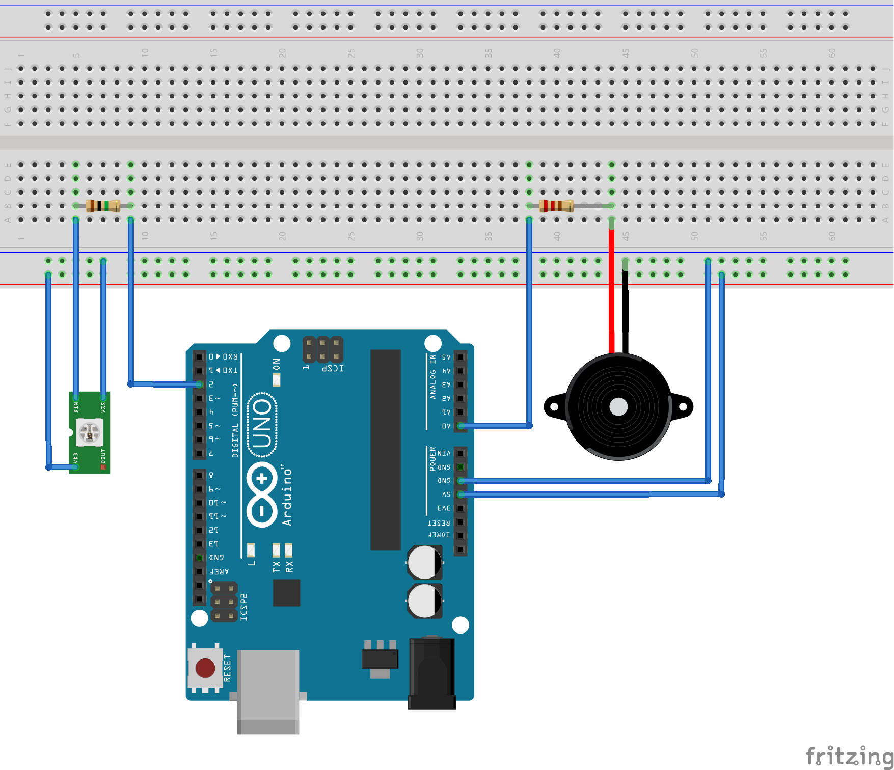

Bongo Hero
=========

Bongo Hero is an [Arduino](https://www.arduino.cc/) based game inspired by [Guitar Hero](https://fr.wikipedia.org/wiki/Guitar_Hero).

# Hardware components

* Arduino UNO *1
* WS2812B Addressable RGB LED Strip 1m *4
* 220 Ohm resistor *4
* Piezo electric disc *4
* Megohm resistor *4

# Schematics

Simplified version using 1 strip of 1 led (i.e. 1 led) and 1 piezo.

# Dependencies

* [FastLed](http://fastled.io/)

# Recommended Resources

* [LED Strip Tutorial](https://randomnerdtutorials.com/guide-for-ws2812b-addressable-rgb-led-strip-with-arduino/)
* [Piezo Example](https://www.arduino.cc/en/Tutorial/Knock)